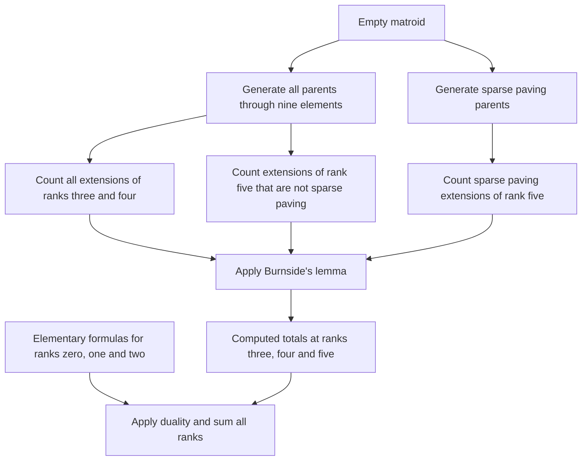

# How the count works

The pipeline counts matroids on ten elements by aggregating extensions of smaller
matroids. Sparse paving extensions use a counter for independent sets; general
extensions use modular cuts and the same counter. Burnside's lemma combines
counts of matroids fixed by each permutation type to count isomorphism classes.

We count each rank separately on a fixed ground set, with no assumptions
of simplicity, connectedness or representability. Unlabeled counts use the
action of the ground-set permutation group, not an equivalence that also
identifies a matroid with its dual.



## 1. Generate the smaller parents

The pinned [IC generator](https://github.com/gmou3/matroid-generator) recursively
constructs single-element extensions using linear subclasses and accepts
canonical basis representations. Starting from the trivial matroids, we
generate ranks through half the ground-set size and obtain the
other ranks by duality. A subset dynamic program converts the basis encoding
into the rank of every subset.

This produces 190,214 parents of rank five on nine elements, of which 113,063
are sparse paving. Generation and counting are separate: the catalogue through
nine elements is manageable, whereas a ten-element catalogue would contain
trillions of representatives.

Code: [`generate_parents.py`](../scripts/generate_parents.py),
[`colex_to_rank.cpp`](../src/colex_to_rank.cpp), and the
[upstream generator](../vendor/matroid-generator/src/IC.cpp).

## 2. Count sparse paving matroids with independent sets

A sparse paving matroid of rank $r$ is specified by its circuit-hyperplanes, which
form an independent set (also called a stable set) of the Johnson graph $J(n,r)$.
Its vertices are $r$-subsets; two are adjacent if and only if their intersection
has size $r-1$.

Distinguish a ground-set element $e$. Let $A$ be the blocks containing $e$, with
$e$ removed, and let $B$ be the blocks not containing $e$. Then $A$ is independent
in $J(n-1,r-1)$, and $B$ is independent in $J(n-1,r)$ with the supersets of $A$
excluded. Let $L^{\mathrm{sp}}_{n,r}$ count labeled sparse paving matroids and
$i(G)$ count independent sets, including the empty set. Then

```math
L^{\mathrm{sp}}_{n,r}=\sum_{[A]}\frac{(n-1)!}{|\mathrm{Aut}(A)|}
 i\bigl(J(n-1,r)-\Gamma^+(A)\bigr),
\qquad \Gamma^+(A)=\left\{b\in\binom{[n-1]}r:\exists a\in A,\ a\subset b\right\}.
```

Each parent contributes an exact number of labeled extensions. The counter
uses include/exclude branching, isolated vertices, connected
components, path/cycle formulas and a bounded cache with complete state keys.

For rank five on ten elements, parents with few blocks leave large residual
graphs. We handle parents with at most five blocks by exact inclusion–exclusion.
Completion counts for small independent sets are obtained by double counting
in the freshly generated catalogue of sparse paving matroids of rank four on nine elements.
Higher terms vanish because an independent subset of the forbidden set can meet
each of its covering cliques at most once.

The generator uses canonical deletion and inherited automorphism groups. Cheap
invariant signatures resolve most candidate deletions; exact canonicalization
resolves ties. Canonical construction paths are established methodology.

Code: [`augment_sparse.cpp`](../src/augment_sparse.cpp),
[`split_count.cpp`](../src/split_count.cpp),
[`small_extensions.hpp`](../src/small_extensions.hpp),
[`count_sparse.py`](../scripts/count_sparse.py).

## 3. General matroids: count modular cuts

For a parent $N$ of rank $r$, introduce a Boolean variable $x_F$ for every flat.
The meaning is that the new element belongs to the closure of $F$. A nonempty
modular cut satisfies

$$
x_F\Rightarrow x_G\quad(F\subseteq G),\qquad
x_F\land x_G\Rightarrow x_{F\cap G}
$$

whenever $F,G$ are a modular pair:

$$r_N(F)+r_N(G)=r_N(F\cup G)+r_N(F\cap G).$$

Force the top flat to be selected. These assignments are precisely the
rank-preserving single-element extensions. The empty cut is the coloop
extension and is accounted for using parents of rank $r-1$.

Identify flat variables in orbits under the parent automorphism being tested.
Propagate all constraints, then branch on unresolved flats of rank at most
$r-2$. Define the conflict graph on hyperplane orbits: two distinct orbits are
adjacent if and only if some hyperplane from each has an intersection of rank
$r-2$. Once the lower flats are fixed and propagation finishes, completions
correspond to independent sets of the subgraph induced by the undecided orbits.
Constraints within an orbit are also handled by propagation.

For nine-element parents of rank five, there are at most $\binom94=126$
hyperplanes. Thus the existing 128-bit graph representation still fits.
**Each graph has a fresh cache:** a mask of the remaining vertices alone is not
a valid global cache key across different graphs.

Code: [`extension_worker.cpp`](../src/extension_worker.cpp), especially
`Matroid::automorphisms`, `conjugacy_classes` and `CutCounter`.

## 4. Omit the already counted sparse paving family

A parent that is not sparse paving cannot have a sparse paving extension.
For a sparse paving parent of rank five on nine elements, an extension of the
same rank fails to be sparse paving exactly when its modular cut selects a flat
of rank at most three or a dependent hyperplane of size five. These events create
a short circuit or cocircuit, respectively.

Mark the variables for these flats. Branching on lower flats tracks whether
any marked variable has been selected. Once the lower variables are fixed,
partition the remaining choices by the first selected marked hyperplane.
Choices with no marked variable selected are omitted. This includes both
paving extensions that are not sparse paving and extensions that are not paving.

## 5. Count isomorphism classes with Burnside's lemma

Simply counting extension orbits over every parent counts pointed matroids
$(M,e)$. A matroid occurs once per element orbit, so dividing that sum by $n$
is incorrect. Instead compute the number fixed by each permutation cycle type
and average over $S_n$.

For a partition $\mu\vdash n-1$, let $a_j$ be its number of parts equal to $j$ and set

$$z_\mu=\prod_j j^{a_j}a_j!.$$

For general rank $r$, accumulate a weighted sum $T_{n,r}(\mu)$ over all
parents of rank $r$, weighting each parent by $(n-1)!/|\mathrm{Aut}(N)|$
and summing its invariant modular-cut counts over automorphisms of type $\mu$.
Add the corresponding coloop contribution from parents of rank $r-1$. Writing
$F_{n,r}(\lambda)$ for the number of labeled matroids fixed by a permutation
of cycle type $\lambda$, we obtain

$$F_{n,r}(\mu\cup(1))=\frac{z_\mu T_{n,r}(\mu)}{(n-1)!}.$$

This is checked for integrality separately for every cycle type. At rank five
on ten elements, we count only extensions that are not sparse paving. Duality
pairs the coloop parents of rank four with parents of rank five, so the code
adds one to each count of invariant cuts giving such extensions. At other ranks,
the two parent sums are computed separately.

One representative per conjugacy class **inside the parent automorphism group**
is evaluated, with its full class size. Equal $S_{n-1}$ cycle types are not
merged prematurely; their actions on the parent's flats can differ.

For ten elements, this covers the 30 cycle types with a fixed point. The
remaining twelve derangement types are handled separately. For each permutation,
make one Boolean variable per orbit of $r$-subsets. A true variable
means that every subset in that orbit is a basis. Impose nonempty bases and
all basis exchange clauses:

$$
\neg b_B\lor\neg b_C\lor
\bigvee_{f\in C\setminus B}b_{B-e+f},\qquad e\in B\setminus C.
$$

There are no auxiliary variables, hence no projected-counting correction.
Ganak runs in deterministic exact mode. The hardest rank-four and rank-five
instances, of cycle type $(2,2,2,2,2)$, are each partitioned into all 256
assignments to eight selected variables. All cubes must complete before summing.

Finally, the number $u_{n,r}$ of isomorphism classes is

$$u_{n,r}=\frac1{n!}\sum_{\lambda\vdash n}
 \frac{n!}{z_\lambda}F_{n,r}(\lambda).$$

The identity term is the labeled count. The sparse paving count is added to the
count of the remaining matroids to give the full result at rank five. The group is
$S_{10}$; it does not include complementation of the Johnson graph.

Code: [`export_symmetry.py`](../scripts/export_symmetry.py),
[`run_symmetry.py`](../scripts/run_symmetry.py),
[`count.py`](../scripts/count.py).

## 6. Sum every rank

Ranks zero and one have elementary descriptions. A rank-two matroid consists
of a loop set and at least two nonempty parallel classes. Unlabeled rank-two
counts follow from integer partitions; labeled counts follow from set
partitions of the ground set plus a marker for the loop class.

Compute ranks three, four and five using the extension pipeline, obtain ranks
six through ten by duality, and sum. All arithmetic used in the sums over parents
and final reductions is exact integer arithmetic.

## Mathematical references

- Mayhew–Royle, [Matroids with nine elements](https://arxiv.org/pdf/math/0702316):
  modular cuts, orderly generation, incidence-graph isomorphism and small counts.
- McKay, [Isomorph-free exhaustive generation](https://users.cecs.anu.edu.au/~bdm/papers/orderly.pdf):
  canonical construction paths.
- Matsumoto–Moriyama–Imai–Bremner,
  [Matroid enumeration for incidence geometry](https://doi.org/10.1007/s00454-011-9388-y):
  the parent generator's enumeration approach and the known rank-four benchmark.
