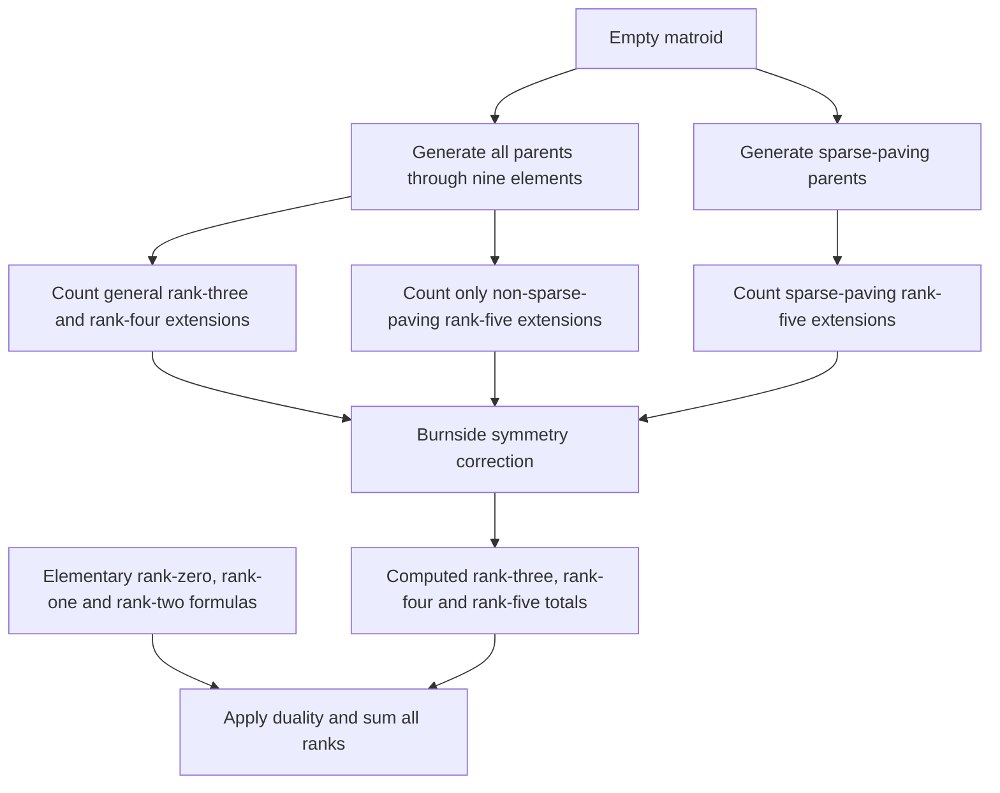

# How the count works

The pipeline counts ten-element matroids by aggregating extensions of smaller
matroids. Sparse-paving extensions use an independent-set counter; general
extensions use modular cuts and the same graph-counting kernel. Burnside's
lemma combines counts of matroids fixed by each permutation type to obtain
isomorphism-class counts.

The scope is rank-specific matroids on a fixed ground set, with no assumptions
of simplicity, connectedness or representability. Unlabeled counts use the
action of the ground-set permutation group, not an equivalence that also
identifies a matroid with its dual.



## 1. Generate the smaller parents

The pinned [IC generator](https://github.com/gmou3/matroid-generator) recursively
constructs single-element extensions using linear subclasses and accepts
canonical basis representations. Starting from the trivial matroids, we
generate ranks through half the ground-set size and obtain the
other ranks by duality. A subset dynamic program converts the basis encoding
into the rank of every subset.

This produces 190,214 parents of rank five on nine elements, of which 113,063
are sparse paving. Generation and counting are separate: the catalogue through
nine elements is manageable, whereas a ten-element catalogue would contain
trillions of representatives.

Code: [`generate_parents.py`](../scripts/generate_parents.py),
[`colex_to_rank.cpp`](../src/colex_to_rank.cpp), and the
[upstream generator](../vendor/matroid-generator/src/IC.cpp).

## 2. Count sparse paving with independent sets

A rank-$`r`$ sparse-paving matroid is specified by its circuit-hyperplanes, which
form a stable set of the Johnson graph $J(n,r)$. Its vertices are $r$-subsets;
two are adjacent when their intersection has size $r-1$.

Distinguish a ground-set element $e$. Let $A$ be the blocks containing $e$, with
$e$ removed, and let $B$ be the blocks not containing $e$. Then $A$ is stable in
$J(n-1,r-1)$, and $B$ is stable in $J(n-1,r)$ with the supersets of $A$ excluded.
Writing $i(G)$ for the number of stable sets, including the empty set, gives

```math
I(n,r)=\sum_{[A]}\frac{(n-1)!}{|\mathrm{Aut}(A)|}
 i\bigl(J(n-1,r)-\Gamma^+(A)\bigr),
\qquad \Gamma^+(A)=\{b:\exists a\in A,\ a\subset b\}.
```

Each parent contributes an exact number of labeled extensions. The independent-
set engine uses include/exclude branching, isolated vertices, connected
components, path/cycle formulas and a bounded cache with complete state keys.

For ten-element rank five, parents with at most five blocks are handled by
exact inclusion–exclusion. Completion counts for small stable sets are obtained
by double incidence counting in the freshly generated nine-element sparse-
paving catalogue. Higher terms vanish because a stable subset of the forbidden
set can meet each of its parent cliques at most once.

The generator uses canonical deletion and inherited automorphism groups. Cheap
invariant signatures resolve most candidate deletions; exact canonicalization
resolves ties. Canonical construction paths are established methodology.

Code: [`augment_sparse.cpp`](../src/augment_sparse.cpp),
[`split_count.cpp`](../src/split_count.cpp),
[`small_extensions.hpp`](../src/small_extensions.hpp),
[`count_sparse.py`](../scripts/count_sparse.py).

## 3. General matroids: count modular cuts

For a rank-$`r`$ parent $N$, introduce a Boolean variable $x_F$ for every flat.
The meaning is that the new element belongs to the closure of $F$. A nonempty
modular cut satisfies

$$
x_F\Rightarrow x_G\quad(F\subseteq G),\qquad
x_F\land x_G\Rightarrow x_{F\cap G}
$$

whenever $F,G$ are a modular pair:

$$r(F)+r(G)=r(F\cup G)+r(F\cap G).$$

Force the top flat to be selected. These assignments are precisely the
rank-preserving single-element extensions. The empty cut is the coloop
extension and is accounted for using parents of rank $r-1$.

Identify flat variables in orbits under the parent automorphism being tested.
Propagate all constraints, then branch on unresolved flats of rank at most
$r-2$. Once these lower flats are fixed, the remaining hyperplane choices form
an independent-set problem: two undecided hyperplanes conflict when their
intersection has rank $r-2$. Constraints with repeated orbit variables are
propagated before calling the graph engine.

For nine-element parents of rank five, there are at most $\binom94=126$
hyperplanes. Thus the existing 128-bit graph representation still fits.
**Each parent/automorphism graph has a fresh cache:** a remaining-vertex mask
alone is not a valid global cache key across different graphs.

Code: [`extension_worker.cpp`](../src/extension_worker.cpp), especially
`Matroid::automorphisms`, `conjugacy_classes` and `CutCounter`.

## 4. Omit the already counted sparse-paving family

Every extension of a non-sparse-paving parent remains non-sparse-paving.
For a sparse-paving rank-five parent, an extension is non-sparse-paving exactly
when its modular cut selects a flat of rank at most three or a dependent
rank-four hyperplane of size five. These events create a short circuit or
cocircuit, respectively.

The lower-flat branching tracks whether a bad event has occurred. At a graph
leaf, any remaining bad hyperplanes are handled by disjoint first-true
branches. The all-bad-false family is omitted. This counts paving but
non-sparse-paving extensions as well as non-paving extensions.

## 5. Recover unpointed counts with Burnside's lemma

Simply counting extension orbits over every parent counts pointed matroids
$(M,e)$. A matroid occurs once per element orbit, so dividing that sum by $n$
is incorrect. Instead compute the number fixed by each permutation cycle type
and average over $S_n$.

For a partition $\mu\vdash n-1$, let

$$z_\mu=\prod_j j^{a_j}a_j!.$$

For general rank $r$, accumulate an integer moment $T_\mu$ over all
rank-$`r`$ parents, weighting each parent by $(n-1)!/|\mathrm{Aut}(N)|$
and summing its invariant modular-cut counts over automorphisms of type $\mu$.
Add the corresponding coloop contribution from rank-$`(r-1)`$ parents. Then

$$F(\mu\cup(1))=\frac{z_\mu T_\mu}{(n-1)!}.$$

This is checked for integrality separately for every cycle type. For
non-sparse-paving rank five on ten elements, duality pairs the rank-four
coloop parents with rank-five parents, so the worker adds one to each invariant
non-sparse cut count. The same shortcut is not used at unbalanced ranks.

One representative per conjugacy class **inside the parent automorphism group**
is evaluated, with its full class size. Equal $S_{n-1}$ cycle types are not
merged prematurely; their actions on the parent's flats can differ.

For ten elements, this covers the 30 cycle types with a fixed point. The
remaining twelve derangement types are handled separately. For each permutation,
make one Boolean variable per orbit of rank-sized subsets. A true variable
means that every subset in that orbit is a basis. Impose nonempty bases and
all basis-exchange clauses:

$$
\neg b_B\lor\neg b_C\lor
\bigvee_{f\in C\setminus B}b_{B-e+f},\qquad e\in B\setminus C.
$$

There are no auxiliary variables, hence no projected-counting correction.
Ganak runs in deterministic exact mode. The hardest rank-four and rank-five
instances, of cycle type $(2,2,2,2,2)$, are each partitioned into all 256
assignments to eight selected variables. All cubes must complete before summing.

Finally, for each rank,

$$u_{n,r}=\frac1{n!}\sum_{\lambda\vdash n}
 \frac{n!}{z_\lambda}F_{n,r}(\lambda).$$

The identity term is the labeled count. The sparse-paving and non-sparse-paving
parts are added before the full rank-five result is reported. The group is
$S_{10}$; it does not include complementation of the Johnson graph.

Code: [`export_symmetry.py`](../scripts/export_symmetry.py),
[`run_symmetry.py`](../scripts/run_symmetry.py),
[`count.py`](../scripts/count.py).

## 6. Sum every rank

Ranks zero and one have elementary descriptions. A rank-two matroid consists
of a loop set and at least two nonempty parallel classes. Unlabeled rank-two
counts follow from integer partitions; labeled counts follow from set
partitions of the ground set plus a marker for the loop class.

Compute ranks three, four and five using the extension pipeline, obtain ranks
six through ten by duality, and sum. All arithmetic used in the final moments
and sums is exact integer arithmetic.

## Mathematical references

- Mayhew–Royle, [Matroids with nine elements](https://arxiv.org/pdf/math/0702316):
  modular cuts, orderly generation, incidence-graph isomorphism and small counts.
- McKay, [Isomorph-free exhaustive generation](https://users.cecs.anu.edu.au/~bdm/papers/orderly.pdf):
  canonical construction paths.
- Matsumoto–Moriyama–Imai–Bremner,
  [Matroid enumeration for incidence geometry](https://doi.org/10.1007/s00454-011-9388-y):
  the parent generator's enumeration approach and the known rank-four benchmark.
